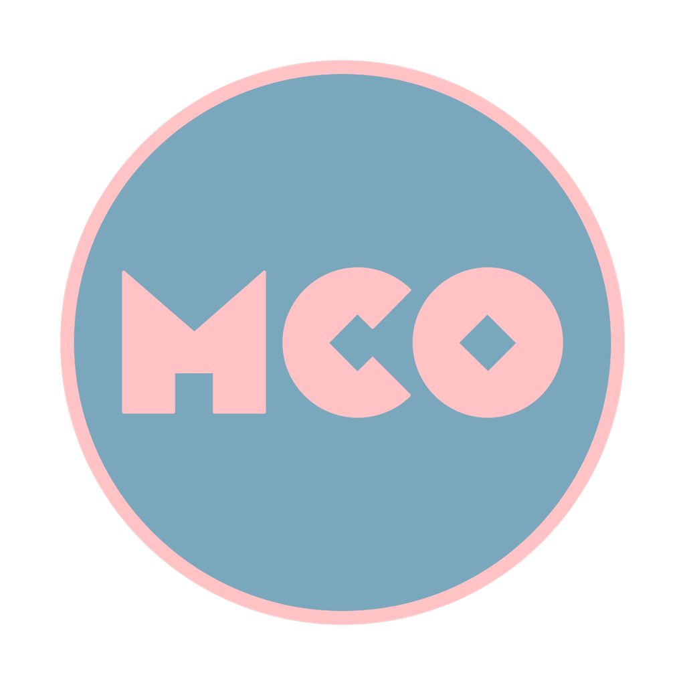

<p align="center">
  
</p>

# MCO - Music Collection Organizer

An Electron desktop app (macOS only for now) that scans a DJ's local music
collection, extracts tags and audio analysis (BPM, musical key, waveform)
per track, stores everything locally, and lets you browse/search/filter
and tag the collection through a dark-themed UI.

Also understands Google Drive for Desktop "cloud-only" placeholder files —
they show a cloud badge and can be downloaded (materialized locally) and
analyzed on demand, one track at a time.

## Features

- **Local-first collection**: scan a folder, extract ID3 tags + BPM/key/
  waveform, browse/search/filter, and organize with your own Genre/
  Sub-Genre/Mood tags (batch-editable, with export/import).
- **Play queue**: a FIFO queue, not a saved playlist — the track playing
  is always at the head, and once it finishes it's gone, not just skipped
  past. "Play track now" / "Add to queue" / "Play next" from a row's
  right-click menu or its play-circle icon. Expand it to full screen from
  the footer player's chevron for drag-to-reorder, remove, a continuous
  vs. manual-advance toggle, and total queue duration.
- **Independent footer player**: waveform (doubles as the seek bar) with
  a live progress line, play/pause, skip to the next queued track,
  volume, elapsed/remaining time (click the time to toggle between
  them) — separate from row selection, so browsing track details doesn't
  interrupt playback.
- **Delay + reverb FX**, synthesized (no bundled assets), with a
  BPM-sync button on the delay time, in their own panel alongside the
  full-screen queue (with room reserved for an upcoming Dub Siren
  module). Settings persist across restarts.
- **MIDI mapping**: click the piano icon next to any FX control or the
  volume slider, twist or press a hardware knob/button, done — bindings
  persist too. On/off controls (Delay, Reverb) bind to a hardware button
  rather than a knob threshold, and light its LED to mirror the app's
  state where the controller supports it.
- **Native file drag-out**: drag a row straight to Finder, a DAW, or any
  other app — it hands off the file's existing path (a reference, like
  any Finder drag), nothing is copied. Right-click → "Show in File
  Explorer" reveals it in Finder instead.
- **AIFF playback**: transcoded to FLAC on demand and cached, since
  Chromium's `<audio>` element can't decode AIFF natively.
- **Backups**: automatic daily backups with pruning and restore, and a
  Settings modal showing backup health.
- The detail panel shows embedded cover art (when present) and full ID3
  metadata (collapsible) alongside your own curated tags.

## Stack

Electron + `electron-vite` + React + TypeScript, `node:sqlite` (Node's
built-in synchronous SQLite — no native module to compile), `electron-store`,
`music-metadata`, `ffmpeg-static`, `essentia.js` (WASM, run in a
`worker_threads` pool so analysis doesn't block the UI), the Web Audio API
and Web MIDI API (both browser-native, no extra dependency), `zustand`,
Vitest.

## Getting started

```bash
npm install
npm run dev     # launch the app in dev mode (hot reload)
npm test        # run the test suite
```

### Build and run right now

```bash
npm run build              # production build → out/main, out/preload, out/renderer
npx electron out/main/index.js   # launch the built app
```

`npm run dev` is the normal day-to-day way to run it (hot reload, DevTools
open). Use the build-and-run steps above when you want to launch exactly
what a production build produces — e.g. to sanity-check a release, or on
a machine where `npm run dev`'s dev server isn't available.

### Packaging a real .app

```bash
npm run dist         # packages the production app to release/mac-arm64/
npm run dist:beta    # packages AND installs a separate BETA app alongside
                      # production — its own bundle id and userData
                      # directory (own DB/config/backups), never touches
                      # the production install
```

Both are unsigned/local-only builds (no code-signing identity configured).
`package.json`'s version is bumped automatically (patch) and tagged on
every merge to `main` via `.github/workflows/version-bump.yml`.

The app's data lives outside the repo, under Electron's per-app userData
directory (on macOS: `~/Library/Application Support/<app name>/`) —
`collection.db` (the SQLite database) and the config store (collection
folder path, window state). Deleting that directory resets the app to a
clean state.

## Project layout

- `electron/main/` — main process: SQLite schema and data access, the
  folder scan/diff pipeline, cloud-only detection, the analysis pipeline
  (metadata/BPM/key/waveform) and its worker-thread pool, AIFF-to-FLAC
  transcoding, backups, and IPC handlers.
- `electron/preload/` — the typed `contextBridge` API exposed to the
  renderer (`window.api`). The renderer never touches Node/fs/DB directly.
- `src/` — the React renderer: the layout (track table, folder/tag trees,
  detail panel, footer player), zustand store, and `src/audio/` (the Web
  Audio FX graph and Web MIDI mapping, both renderer-only — no IPC needed
  for either).
- `tests/fixtures/` — synthetic WAV/AIFF-tone generators shared by the
  audio pipeline's tests.

## Status

v1 is implemented and runs. See `TODO.md` for what's fixed, what's still
open, and the design docs it was built from
(`docs/superpowers/specs/`, `docs/superpowers/plans/`).
