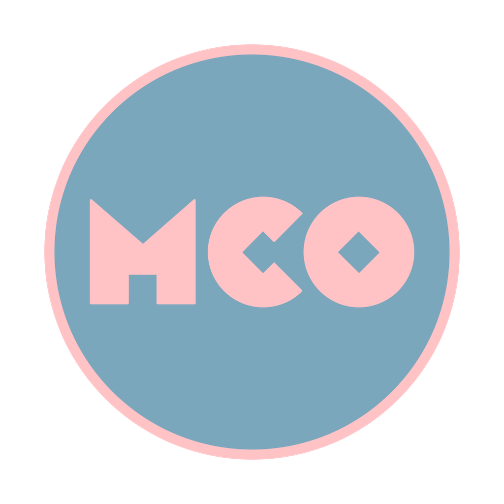

<p align="center">
  
</p>

# MCO - Music Collection Organizer

MCO is a desktop app for DJs who keep their music as files on disk. Point
it at your collection folder and it finds every track, works out its BPM,
musical key, energy, and waveform, and lets you browse, search, tag, and
play the whole collection in one place. It also has playlists, hot cues,
a play queue, DJ-style effects, a microphone with its own effects, recording of your sets and
podcasts, MIDI controller support, a full-screen music visualizer, and
casting to your TV — and it works alongside Rekordbox.

Everything stays on your machine. MCO never uploads your music, and it
never changes your audio files: tags and analysis results are kept in
MCO's own database.

> **Platform:** macOS on Apple silicon (M1 or newer).
>
> **Website:** [festanqueiro.github.io/music-collection-organizer](https://festanqueiro.github.io/music-collection-organizer/) — features, clips and download.

## Features

- **Your collection, organized** — scans a folder of WAV, AIFF, FLAC, MP3,
  M4A/AAC, and OGG/Opus files, picks up new downloads on its own, reads
  their tags and cover art, and measures BPM, key, loudness (LUFS), a 1–10
  energy rating, and waveform. A Volume Score column says how many dB to
  turn a track up or down to match the rest, and an Energy filter picks
  warm-up, build or peak tracks. If a file can't be analysed, MCO says
  why, with Try again. Keeps a play count and when each track was
  last played. Sort, search, and filter by folder or tag. Files that go
  missing are hidden, not forgotten, so their tags come back when the
  drive does.
- **Tempo you can trust, and fix** — the BPM is measured over the whole
  track, and the common slip on broken beats (two thirds of the tempo) is
  caught. **Refine BPM** in a track's menu doubles it, halves it, applies
  the two-thirds fix or takes the number you type, and keeps it through
  later analyses.
- **Convert** — right-click a track to write its file again as WAV, AIFF,
  FLAC, Apple Lossless, MP3 or AAC, at 16 or 24-bit and the sampling
  frequency you choose: a copy next to the original or in another folder,
  or in its place (the original goes to the Trash; tags, cues and
  playlists stay).
- **Your own tags** — organize tracks with your own genres and
  sub-genres, filterable with AND/OR, taggable in bulk, with undo and
  export/import. Every tag and subtag gets its own colour automatically
  (change it any time): tag badges are filled with it, subtag badges
  outlined in theirs.
- **Playlists** — playlists and folders in a box under the sidebar. Add
  songs by dragging rows onto a playlist, from the right-click menu, or
  from the bar that appears when songs are checked; drag rows to reorder,
  ⌫ to remove (with Undo). Play a playlist or a whole folder (it replaces
  the queue, with Undo), or export it as an m3u8 for Rekordbox. Import
  from Rekordbox's exports and choose what comes in: the playlists, the
  cues, the BPM.
- **Hot cues** — eight per track, A–H, on pads under the player, keys 1–8
  (Shift-1–8 deletes) or your MIDI controller's pads, drawn on the waveform
  in their colours; name and recolour them, delete one with the × on its
  pad (with Undo). MCO suggests cues every 8 bars up to 64 from the start
  of the tune, and you drag a cue along the waveform with a zoom of the
  bars around it (⌥ for fine, Shift snaps to the beat).
- **Play queue** — "play now", "add to queue", or "play next" from any
  track, then reorder, shuffle, and play through the queue continuously,
  on its own full screen.
- **Player** — a waveform you can click to seek, with bar lines, in three
  styles (one colour, coloured by frequency, or bass / mids / highs as
  three bands) and at twice the height when you want it; a CDJ-style cue button,
  volume and mute, macOS media keys and AirPods controls, and a choice of
  audio output device. Rec, Mic and Cast, then Visualizer, FX, Queue and
  Live, sit together at the right of the player bar.
- **Effects** — rotary knobs on their own full screen, in three groups:
  **Music FX** (EQ, low/high-pass filter, a tempo-synced delay, reverb),
  **Mic FX** (your voice's effects, below) and **Instruments** (a dub
  siren). The FX button lights up while an effect is engaged.
- **Mic** — put your voice in the mix from the player bar's Mic button:
  pick the input, watch its level, Talk (tap to mute, hold to talk, or the
  T key), optional noise suppression, and hear yourself only if you want
  to. Its own effects: gain, noise gate, compressor, EQ, pitch shift,
  echo (with throw, tempo-synced), reverb, a radio voice, and ducking that
  turns the music down while you talk.
- **Record** — record what MCO plays (the music with its effects, the
  siren and your mic) to WAV, FLAC or MP3, for podcasts and mixes, with a
  level meter and a recording-level knob. It keeps recording through
  pauses and track changes, and what's recorded survives a quit.
- **Live screen** — the queue and every effect on one screen, for running
  a show.
- **DJ tools** — keys in Camelot notation with a "Compatible" filter for
  harmonic mixing (same key, one step round the [Camelot wheel](https://mixedinkey.com/wp-content/uploads/2024/09/CamelotWheel-Official.webp), or
  the relative major/minor, at a BPM that matches), headphone pre-listen
  on a second output.
- **Rekordbox** — import playlists from Rekordbox (its collection XML,
  m3u8 or text exports), including old USB-stick playlists whose paths no
  longer match: MCO finds the songs in your collection. Playlists you
  already have are spotted, and you choose to skip, add or update them.
  **Compare with Rekordbox** lists what differs — playlists, song info,
  BPM and key, cue points, files — and brings Rekordbox's cues into MCO.
  MCO's Rekordbox XML export carries your tags, playlists and cues back.
- **MIDI** — map any knob, toggle, or playback button to your controller
  in two clicks, with LED feedback where your controller supports it.
- **Visualizer** — a full-screen, audio-reactive visualizer with twelve
  themes: Nebula, Warp, Horizon, Sound System (a speaker stack that thumps
  along with the music), Smoke, Kaleidoscope, Paint, Liquid, Origins,
  Sponge, Crystal and Tangle. It
  runs at 30 fps by default to keep the GPU cool (15 to 60 fps, or Max).
- **Show on a screen** — the visualizer full screen on a second display (an
  Apple TV as an AirPlay display, a projector, a monitor), drawn by the Mac,
  with a **visual delay** to line it up with sound that arrives late.
- **Casting** — play to a Chromecast, Google TV, or Nest speaker. On a
  TV, MCO's own Cast app plays the music with your effects and dub siren,
  runs the visualizer, and shows a now-playing screen: artwork, tags, BPM,
  key, energy, what's up next (and whether it mixes), and the effects
  you're using.
- **Themes** — three dark (MCO Dark, Midnight, Carbon) and three light
  (MCO Light, Paper, Arctic) colour themes, in **Settings → Appearance**.
- **Settings** — organised into pages: Library, Appearance, Audio, MIDI,
  Import & export, Backups & data, and Updates.
- **Google Drive for Desktop** — cloud-only placeholder files are shown
  with a cloud badge and downloaded when you play them.
- **Drag and drop out** — drag tracks straight into Finder, a DAW, or any
  other app.
- **Backups** — automatic daily backups of your library and settings,
  with one-click restore.
- **Automatic updates** — MCO tells you when a new version is out and
  installs it with one click.

The full guide to every feature, every design decision and what's next is in
the [project vault, `docs/`](docs/README.md) — start with the
[feature index](docs/README.md#feature-index), the [roadmap](docs/product/roadmap.md)
and the [changelog](CHANGELOG.md).

## Install

1. Download the latest `MCO-<version>-arm64.dmg` from the
   [Releases page](https://github.com/festanqueiro/music-collection-organizer/releases),
   open it, and drag **MCO** into **Applications**.
2. Open MCO. The first time, macOS warns that it *"could not verify"* the
   app, because MCO isn't registered with Apple's paid developer program.
   Click **Done**, then go to **System Settings → Privacy & Security**,
   click **Open Anyway** next to the MCO message, and confirm.

That's only needed once per Mac. After that, MCO updates itself: when a
new version is out, click **Update and restart** in the banner.

## Building from source


You'll need macOS, [Node.js](https://nodejs.org/) 22.13 or newer, and npm.

```bash
git clone https://github.com/festanqueiro/music-collection-organizer.git
cd music-collection-organizer
npm install
npm run dev     # start the app in development mode (hot reload)
```

On first launch, pick your music folder, then choose whether to analyse
it. Analysis runs in the background and can take a while on a large
collection. You can play and tag tracks in the meantime.

> If `npm run dev` complains that Electron failed to install, run
> `cd node_modules/electron && node install.js` and try again.

### Building the app

```bash
npm run dist            # build "MCO - Music Collection Organizer.app" into release/
npm run dist:install    # build it and copy it into ~/Applications
```

These local builds are meant for the Mac that built them. The
downloadable installer is made by the Release workflow; see
[docs/features/releases-and-updates.md](docs/features/releases-and-updates.md).

There's also `npm run dist:beta`, which installs a separate "BETA" copy
of the app with its own data, handy for testing changes without touching
your main library.

### Running the tests

```bash
npm test                # unit tests (Vitest)
npx tsc -b --noEmit     # type-check
```

## Where your data lives

MCO keeps a database (`collection.db`) and a settings file
(`config.json`). When you first choose your music folder, both move into a
hidden `.mco` folder inside it, so your music and its tags stay together.
You can move them somewhere else in **Settings → Backups & data**.

Tracks are remembered by their full path, so if you move the collection
to a different location, a rescan treats the files as new. Keep the same
path (for example the same drive name) to keep your tags.

Daily backups are kept in
`~/Library/Application Support/<app name>/backups/` (the last 30).

## How it's built

Electron, React, and TypeScript, built with `electron-vite`. It uses
Node's built-in SQLite (`node:sqlite`) for the library, `essentia.js` for
BPM and key detection (in background worker threads), `ffmpeg-static` for
audio decoding, `music-metadata` for tags, the Web Audio and Web MIDI APIs
for effects and controllers, `three.js` for the visualizer, and `zustand`
for app state.

- `electron/main/` — the app's back end: database, folder scanning,
  audio analysis, AIFF playback support, backups.
- `electron/preload/` — the bridge that gives the interface a safe,
  limited API into the back end.
- `src/` — the interface (React): track table, tag and folder trees,
  player, queue, effects (`src/audio/`), casting (`src/cast/`), and the
  visualizer (themes from the
  [threejs-visualisers](https://github.com/festanqueiro/threejs-visualisers)
  package).
- `docs/` — the project vault: `features/` (the feature guide), `adr/`
  (decision records), `research/`, `product/` (vision, roadmap, glossary),
  `log/` (session write-ups, history, original design docs).
- `CHANGELOG.md` — what changed in each release.

## License

[ISC](LICENSE) © Francisco Estanqueiro
